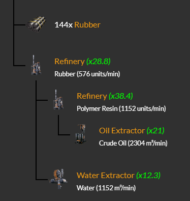

# Satisfactory Fabrikaları Kayıtları

eKLFT tarafından oluşturuldu.

Kaynaklar hariç hiç bir makine(üretim tesisine) hız aşırtma yapılmamıştır.

---

> ## Batarya Organize Sanayi

### Batarya Tesisi

* Üretim
  * 360 batarya/dak

### Aluminyum Kasa Tesisi

* Üretim
  * 600 aluminyum kasa/dak

### Sürfirik Asit Tesisi

* Üretim
  * 900 sülfirik asit/dak

---

> ## Soğutma Sistemi Organize Sanayi v1

3000 nitrojen gazı kullanımı göz önünde bulundurularak inşa edildi.

### Soğutucu Sistemi Tesisi

* Üretim (20 Blender)
  * 120 soğutma sistemi/dak

* Tüketim
  * [ ] 3000 nitrojen gazı/dak (Kaynak)
  * [ ] 600 su/dak (Kaynak)
  * [ ] 240 kauçuk/dak (fabrika)
  * [ ] 240 soğutucu 240/dak (fabrika) (alt.1) (24 üretici)
    * [x] 720 Aluminium casibg (12 üretici)
      * [x] 1080 aluminium ingot (36 üretici)
        * [x] 2160 aluminium scrap (7.2 üretici) + 756 water
          * [x] 1296 aluminia solution (alt.2) (5.4 üretici)
            * [x] 1080 water
            * [x] 1080 bauxite
          * [x] 432 petroleum coke (3.6 üretici)
            * [x] 144 heavy oil residue (7.2 üretici) + 144 rubber
              * [x] 216 curide oil
    * [ ] 720 rubber - 144 rubber
      * [ ] 

### Kauçuk Tesisi

* Üretim
  * a
* Tüketim
  * b

---
